# TeSate - Premium Sate Ordering Experience 🍢

TeSate is a high-end mobile application built with **React Native** and **Expo**, designed to provide a seamless and premium experience for ordering various types of Sate. From a stunning UI to a powerful Admin Dashboard, TeSate bridges the gap between traditional food and modern technology.

## ✨ Key Features

- **Premium UI/UX**: Crafted with modern design principles, featuring smooth animations and a cohesive color palette.
- **Smart Shopping Cart**: Manage your orders easily with real-time quantity adjustments and item selection.
- **Dynamic Order Tracking**: Follow your order status from "Waiting" to "Ready" with a dedicated status screen.
- **Admin Dashboard**: 
  - **Business Overview**: Real-time revenue analytics and order counting.
  - **Order Management**: Monitor and manage customer orders efficiently.
  - **Product CRUD**: Add, edit, and delete menu items directly from the app.
- **Real-time Notifications**: Toast notifications for instant user feedback.
- **Elegant Splash & Onboarding**: First impressions matter, starting with a clean logo splash.

## 📸 Screenshots

### 📱 User Interface

| Start | Splash | Login | Register |
|:---:|:---:|:---:|:---:|
| 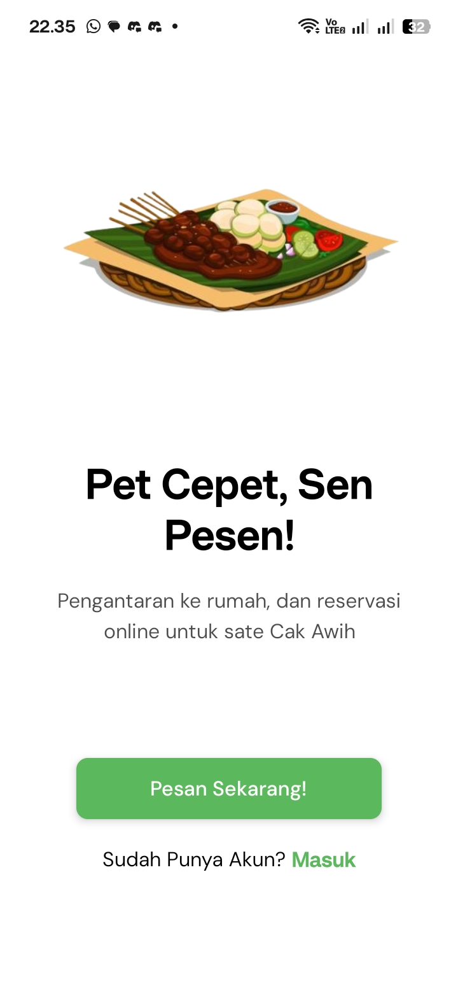 |  | 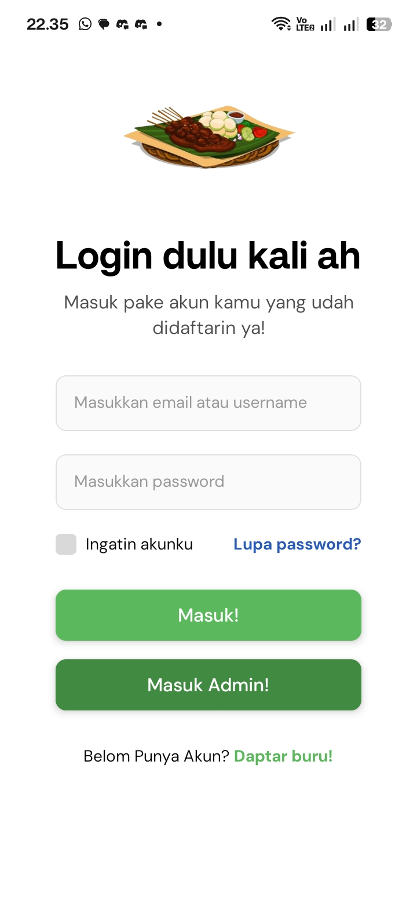 | 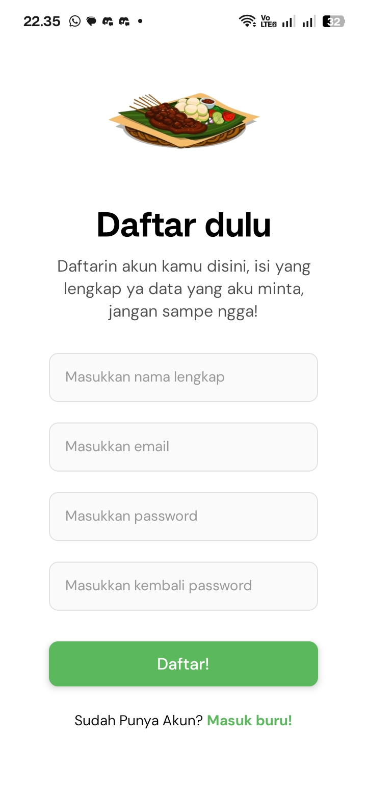 |

| Home | Product Detail | Cart | Order Status |
|:---:|:---:|:---:|:---:|
| 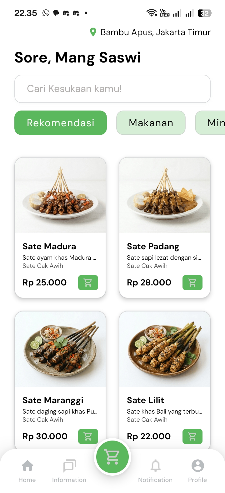 | 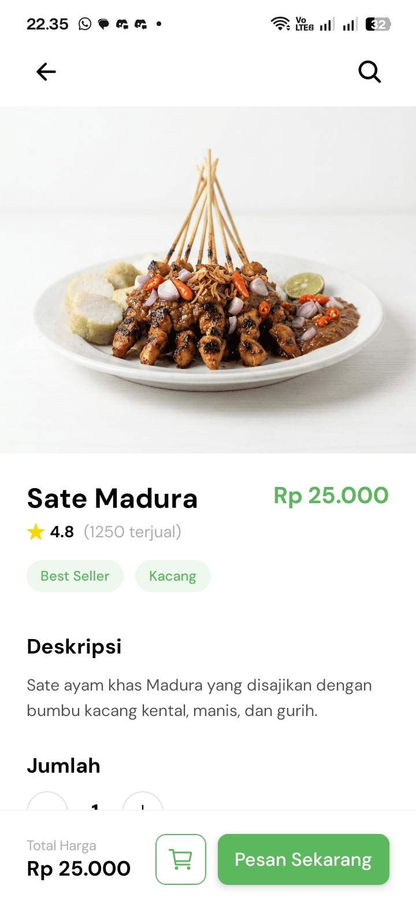 | 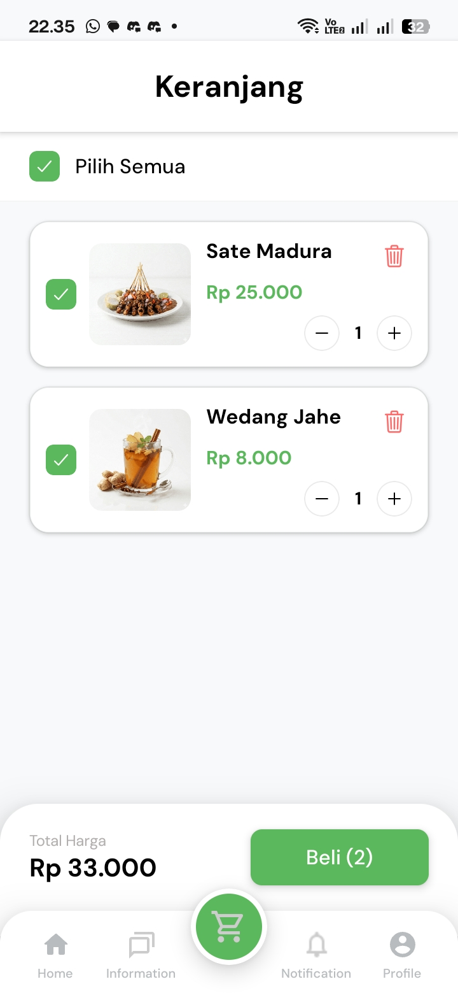 | 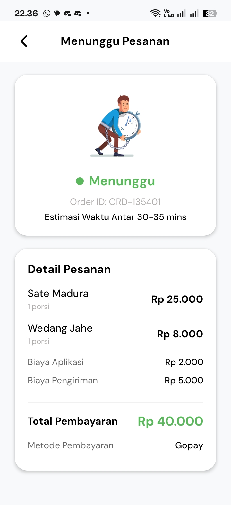 |

| Payment | Payment Methods | Profile | Notifications |
|:---:|:---:|:---:|:---:|
| 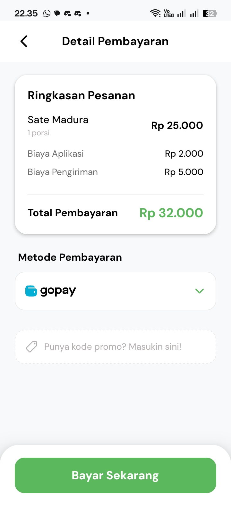 | 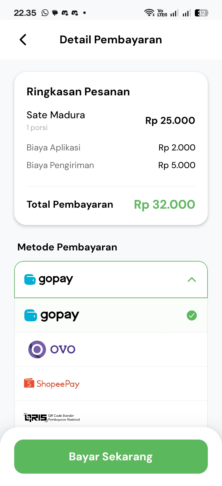 | 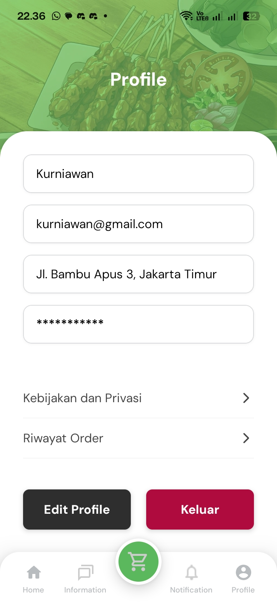 | 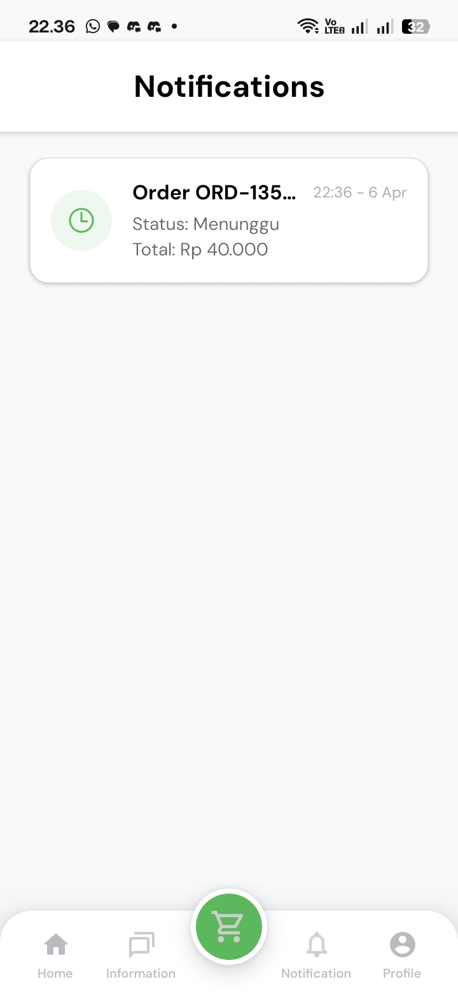 |

### 🛠 Admin Dashboard

| Overview | Orders | Products | Add Product Form |
|:---:|:---:|:---:|:---:|
| 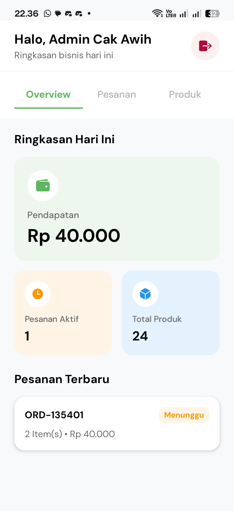 | 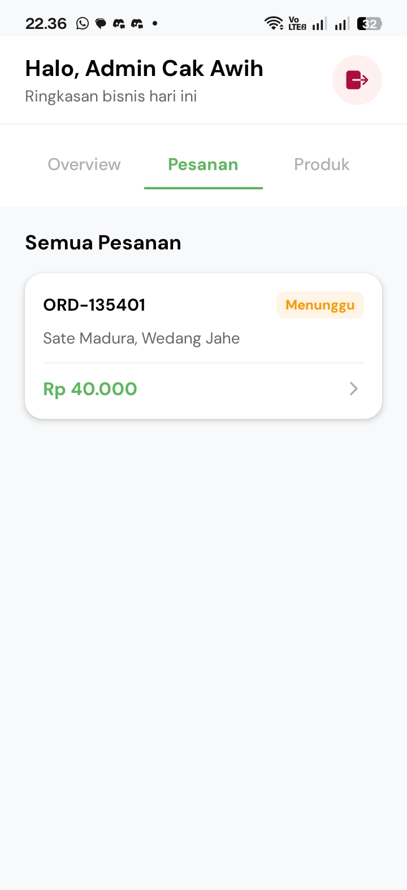 | 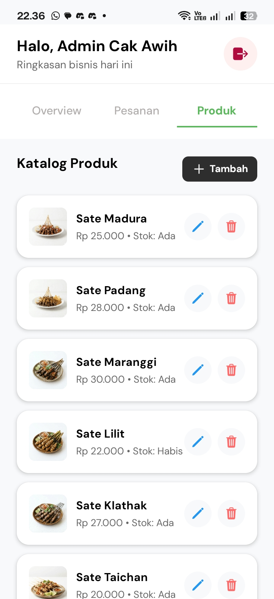 | 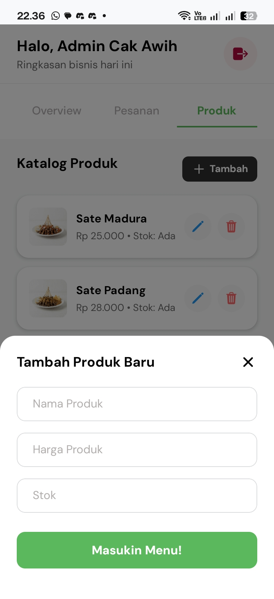 |

## 🛠 Tech Stack

- **Framework**: [Expo](https://expo.dev/) (React Native)
- **Navigation**: [Expo Router](https://docs.expo.dev/router/introduction/) (File-based routing)
- **Styling**: Vanilla React Native StyleSheet
- **Icons**: [Ionicons](https://ionic.io/icons)
- **Images**: [Expo Image](https://docs.expo.dev/versions/latest/sdk/image/)
- **State Management**: React Context API

## 🚀 Getting Started

### Prerequisites

- Node.js (v18+)
- npm or yarn
- Expo Go app on your mobile device (to preview)

### Installation

1. Clone the repository:
   ```bash
   git clone https://github.com/SatuSattr/teSate.git
   cd teSate
   ```

2. Install dependencies:
   ```bash
   npm install
   ```

3. Start the project:
   ```bash
   npx expo start
   ```

4. Scan the QR code with your **Expo Go** app (Android) or **Camera** app (iOS) to run the application.

---
Created with ❤️ by **Ryan N**.
